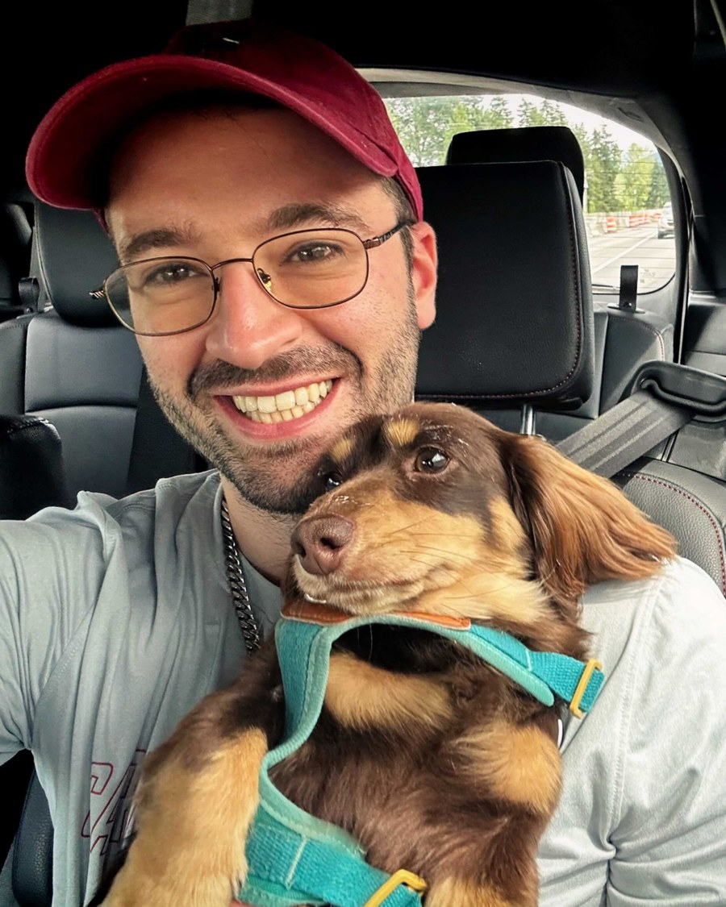

&nbsp;  
My name is Alexander and I'm a researcher interested in evaluating and improving the diversity and creativity of LLMs, and in applying LLMs to complex programming tasks like program optimization and decompilation. 

I'm currently a fifth year PhD student at the University of Pennsylvania, graduating in 2027, where I'm advised by [Osbert Bastani](https://obastani.github.io/). Before that, I spent a year working at MIT's Computer Science and Artificial Intelligence Laboratory (CSAIL) with [Yoon Kim (MIT CSAIL)](https://people.csail.mit.edu/yoonkim/) and [Jie Chen (MIT-IBM Watson AI Lab)](https://jiechenjiechen.github.io/). Earlier, I was a Master's student at Carnegie Mellon University's (CMU) School of Computer Science in the Artificial Intelligence and Innovation program, where I was a member of [Neulab](https://www.cs.cmu.edu/~neulab/index.html) and advised by [Graham Neubig](http://www.phontron.com/). 

## Publications


{{ p.authors }}. ["{{ p.title }}"]({{ p.url }}). {{ p.venue }}. <small>{{ p.note }}</small>


<small>Full list on [Google Scholar](https://scholar.google.com/citations?user=JGStAr0AAAAJ&hl=en).</small>

## Contact

You can reach me at shypula 👨‍💻 seas ☕ upenn 🚴 edu. 

## Background 

I've been interested in improving the performance of deep learning models for code and symbolic domains since the first systems course I took. AI in these symbolic domains is interesting because of the feedback loops available: code can be analyzed and executed in ways natural language cannot. Because of this, when I started my PhD I hoped research would focus not only on imitating human programmers, but on how AI models can teach us to program and reason better, like AlphaGo's [move 37](https://en.wikipedia.org/wiki/AlphaGo_versus_Lee_Sedol#Game_2). We're seeing this today with the incredible capacity of tools like Claude Code, Codex, and LLM theorem provers. 

On the programming side, I've worked on program optimization, where a model has to find faster code that is still correct, and on decompilation, where it has to recover readable source from compiled binaries. Both are hard, verifiable tasks where feedback from running the code, rather than imitation alone, is what lets the model improve.

I think a major vector for self-improving AI is going to be the loop of generating synthetic data, filtering it, and then re-training on it. My work on the diversity and creativity of LLMs has two purposes. One is avoiding the "artificialness" of mode collapse and the syntactic slop we get from frontier LLMs. The other is understanding how diversity lets models generate useful synthetic data, or, in RL language, "explore" novel problems and self-improve. 

My family roots are in Poland: my parents fled an oppressive authoritarian regime, and their parents lived through genocide and the uprooting of mass migration after the Second World War. We've been fortunate and unfortunate in different ways, and I've learned that the purpose of life lies in overcoming obstacles, not in outcomes. 

<!-- ## Other

I am currently really into specialty coffee, and I'm always looking to connect with people on this topic as well; hit me up if you want to chat about coffee! I've recently even begun to roast coffee to learn more about the process.  -->

<!-- 
Besides CS research, I like walking up big, tall, snowy things: some mountains on my list are (in increasing altitude) [Mt. Rainier](https://en.wikipedia.org/wiki/Mount_Rainier), [Denali](https://en.wikipedia.org/wiki/Denali), [Aconcagua](https://en.wikipedia.org/wiki/Aconcagua), and [Cho Oyu](https://en.wikipedia.org/wiki/Cho_Oyu). Here are [some photos](baker.md) of me doing a (very) stochastic gradient ascent on a practice rescue line in a crevasse on Mt. Baker.  -->

